# hello_world

A new Flutter project.

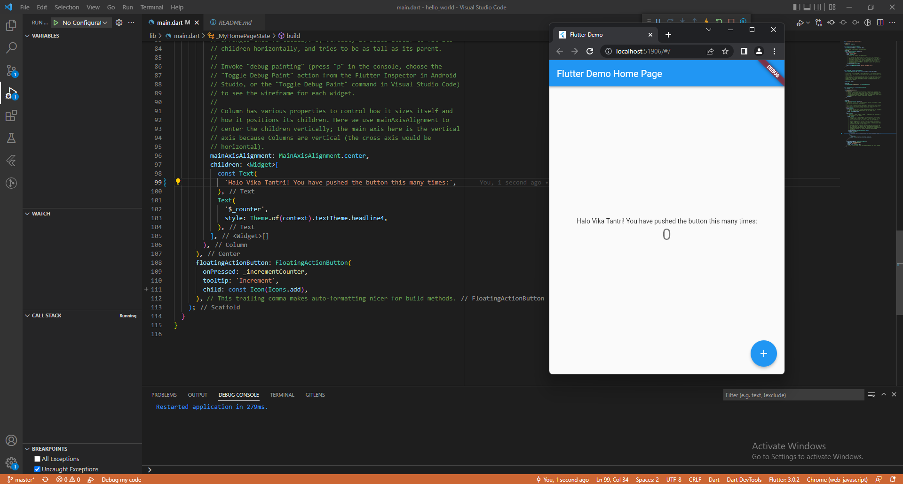

# Praktikum 1: Membuat Project Flutter Baru

1. Membuat project baru pada vscode

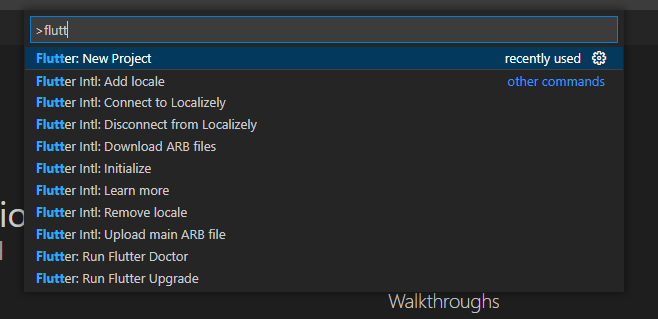

2. Tampilan kode ketika sudah membuat project baru pada vscode

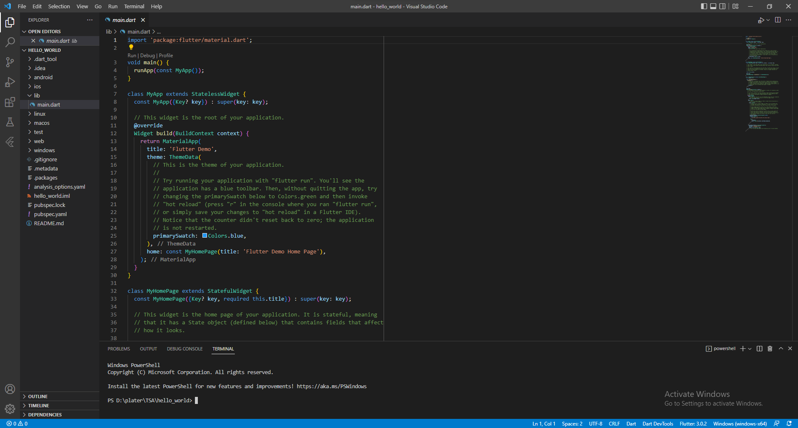

# Praktikum 2: Membuat Repository GitHub dan Laporan Praktikum

1. Membuat repository baru pada GitHub

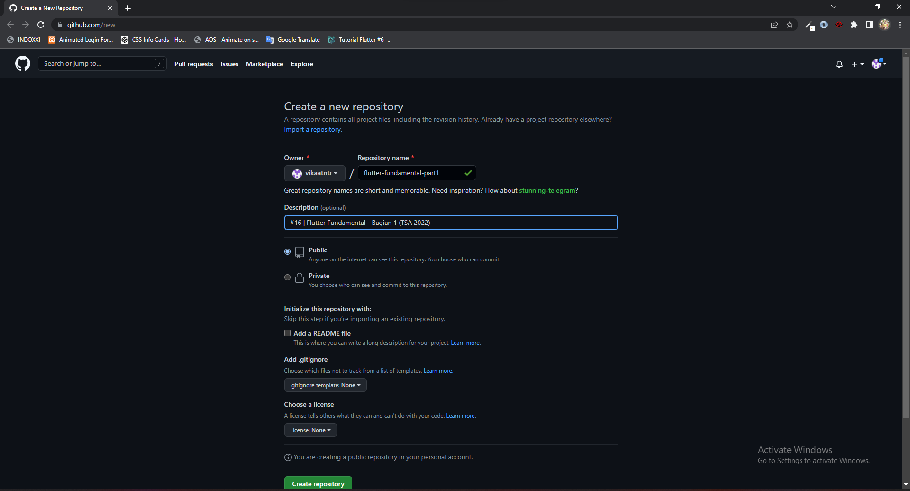

2. Tampilan apabila telah berhasil membuat repository baru pada GitHub

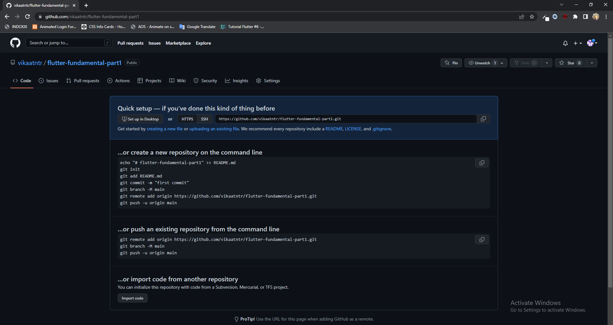

3. Inisialisasi git pada project

4. Pilih menu Source Control di bagian kiri, lalu lakukan stages (+) pada file .gitignore untuk mengunggah file pertama ke repository GitHub dan beri pesan commit "tambah gitignore" lalu klik Commit

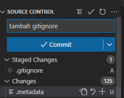

5. Lakukan push dengan klik bagian menu titik tiga > Push

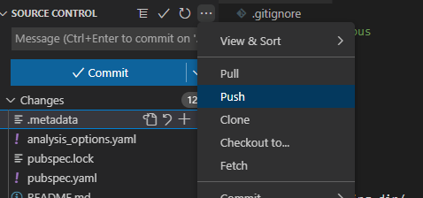

6. Di pojok kanan bawah akan tampil seperti gambar berikut. Klik "Add Remote"

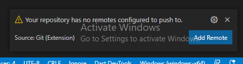

7. Salin tautan repository Anda dari browser ke bagian ini, lalu klik Add remote
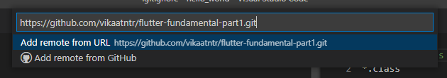

8. Setelah berhasil, tulis remote name dengan "origin"
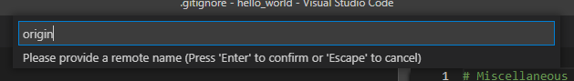

9. Menambahkan file README.md pada repository GitHub
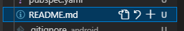

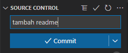

10. Berhasil menambahkan file README.md

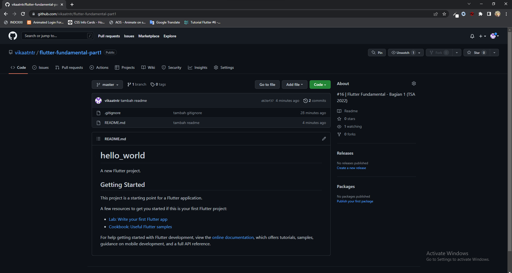

11. Lakukan push juga untuk semua file lainnya dengan pilih Stage All Changes

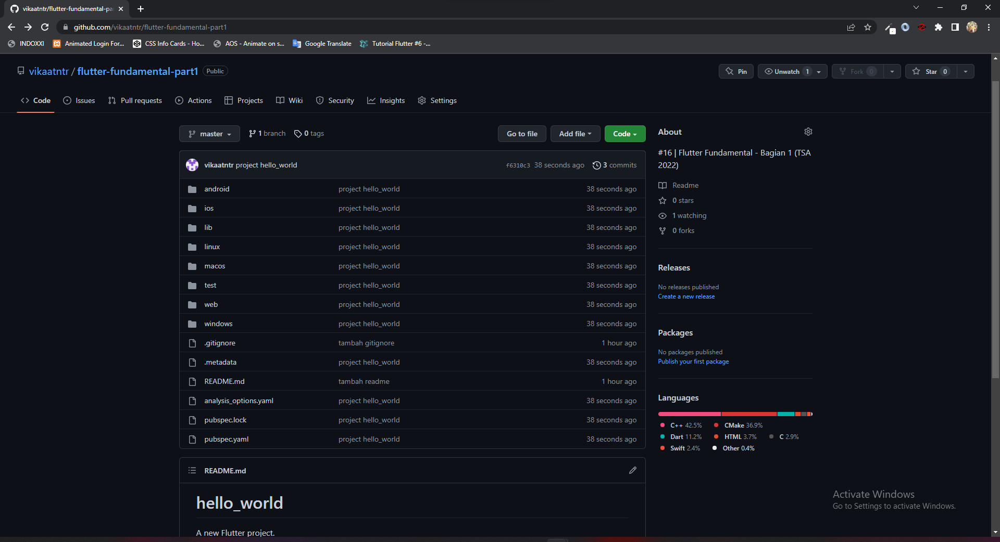

12. Lalu coba running project hello_world dengan tekan F5 atau Run > Start Debugging dengan menggunakan browser

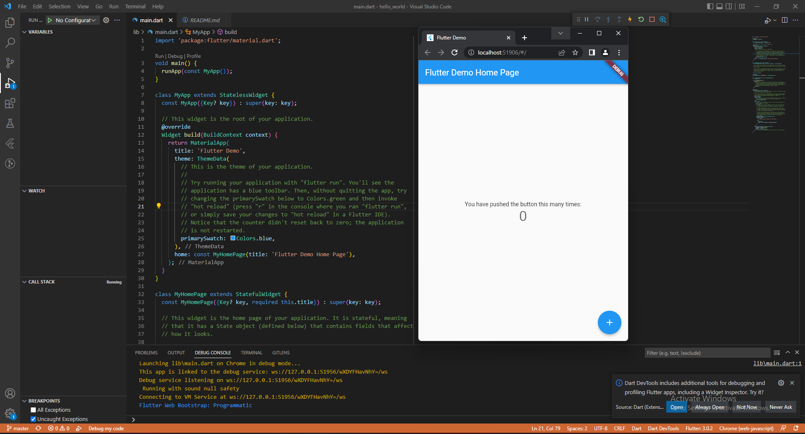

## Getting Started

This project is a starting point for a Flutter application.

A few resources to get you started if this is your first Flutter project:

- [Lab: Write your first Flutter app](https://docs.flutter.dev/get-started/codelab)
- [Cookbook: Useful Flutter samples](https://docs.flutter.dev/cookbook)

For help getting started with Flutter development, view the
[online documentation](https://docs.flutter.dev/), which offers tutorials,
samples, guidance on mobile development, and a full API reference.
