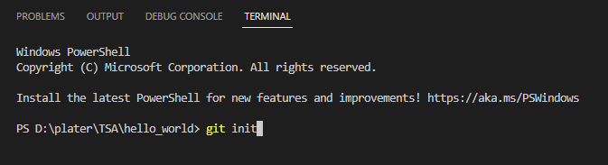
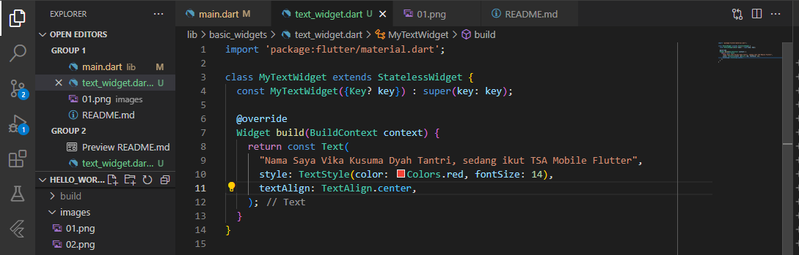
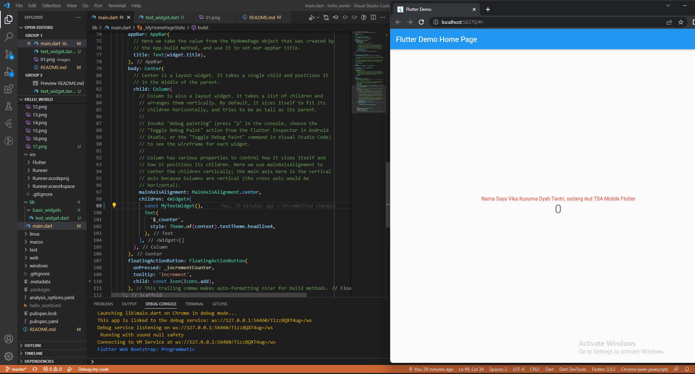
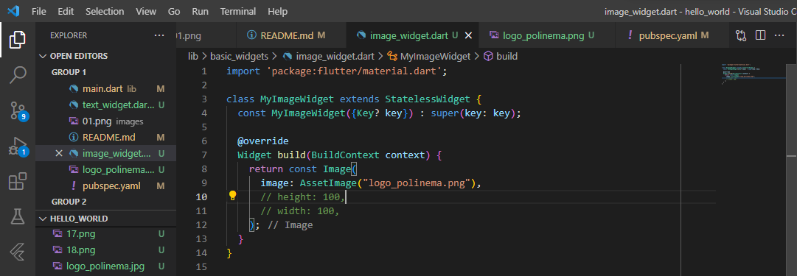
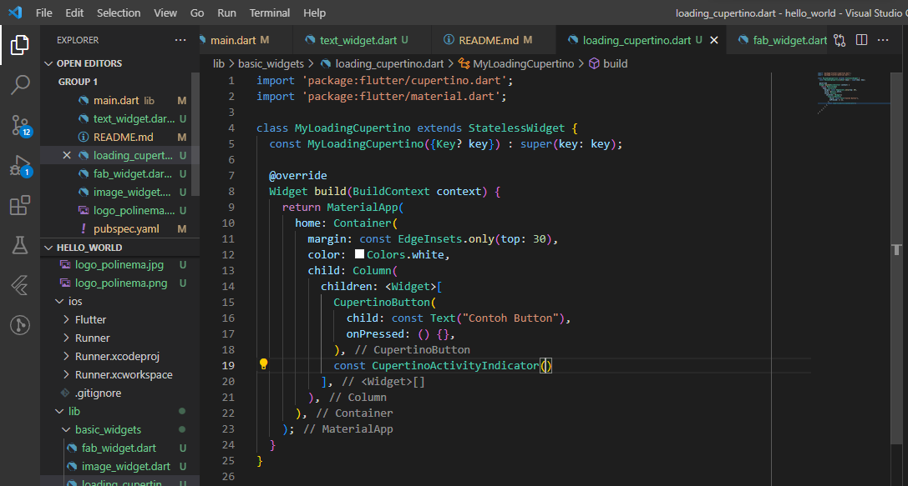
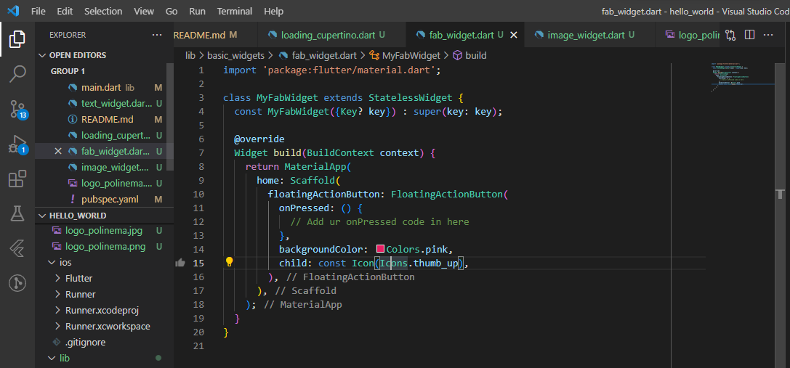
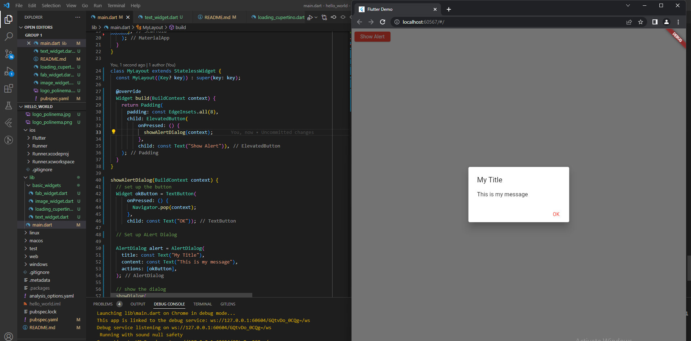
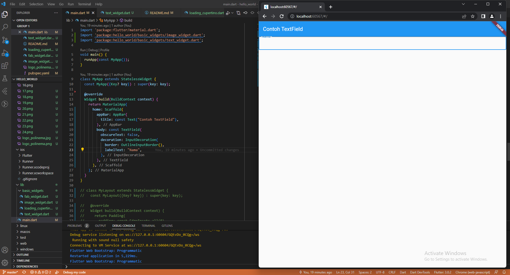
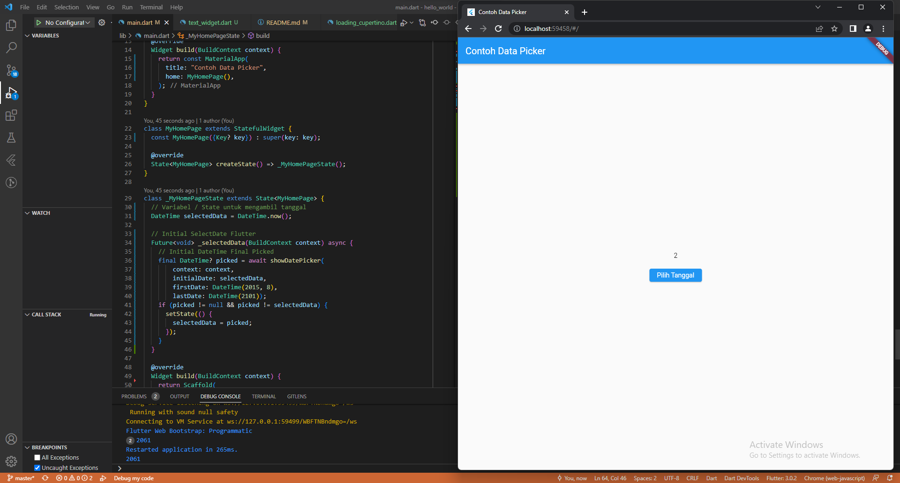

# hello_world

A new Flutter project.

# Praktikum 1: Membuat Project Flutter Baru

1. Membuat project baru pada vscode

2. Tampilan kode ketika sudah membuat project baru pada vscode

# Praktikum 2: Membuat Repository GitHub dan Laporan Praktikum

1. Membuat repository baru pada GitHub

2. Tampilan apabila telah berhasil membuat repository baru pada GitHub

3. Inisialisasi git pada project

4. Pilih menu Source Control di bagian kiri, lalu lakukan stages (+) pada file .gitignore untuk mengunggah file pertama ke repository GitHub dan beri pesan commit "tambah gitignore" lalu klik Commit

5. Lakukan push dengan klik bagian menu titik tiga > Push

6. Di pojok kanan bawah akan tampil seperti gambar berikut. Klik "Add Remote"

7. Salin tautan repository Anda dari browser ke bagian ini, lalu klik Add remote

8. Setelah berhasil, tulis remote name dengan "origin"

9. Menambahkan file README.md pada repository GitHub

10. Berhasil menambahkan file README.md

11. Lakukan push juga untuk semua file lainnya dengan pilih Stage All Changes

12. Lalu coba running project hello_world dengan tekan F5 atau Run > Start Debugging dengan menggunakan browser

# Praktikum 3: Menerapkan Widget Dasar

1. Buat folder baru basic_widgets di dalam folder lib. Kemudian buat file baru di dalam basic_widgets. Kemudian menambahkan kode dalam file basic_widget

2. Lakukan import file text_widget.dart ke main.dart

3. Buat sebuah file image_widget.dart di dalam folder basic_widgets

# Praktikum 4: Menerapkan Widget Material Design dan iOS Cupertino

1. Buat file di basic_widgets > loading_cupertino.dart (Cupertino Button dan Loading Bar)

2. Buat file di basic_widgets > fab_widget.dart (FAB)

3. Ubah isi kode main.dart (Scaffold Widget)

4. Ubah isi kode main.dart seperti berikut. (Dialog Widget)

5. Contoh penggunaan TextField widget

6. Date and Time Picker
